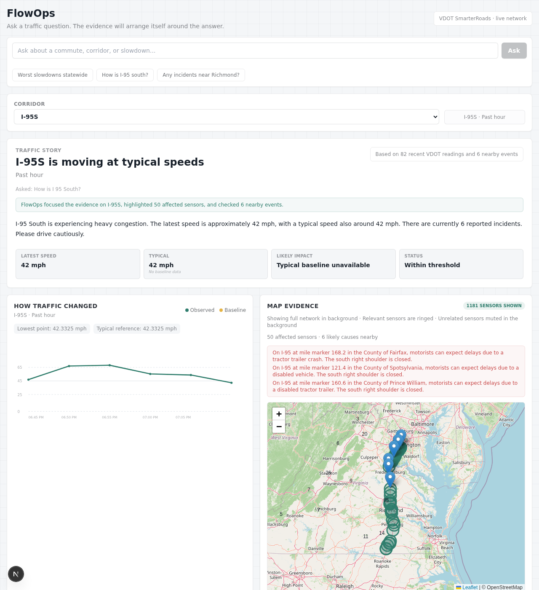

# NoVa Traffic Intelligence Agent (FlowOps)

A conversational traffic analytics platform for Northern Virginia corridors (I-95, I-66, VA-28). It uses real-time VDOT SmarterRoads data to provide grounded, evidence-based answers about traffic conditions, speeds, and anomalies.



## What Is Included

- `apps/web`: Next.js + Tailwind UI with interactive map (Leaflet), speed charts, and agent workspace.
- `apps/api`: FastAPI backend with an LLM-driven corridor intelligence agent (OpenRouter/GPT-4o).
- `infra/postgres`: Postgres/PostGIS schema with automated baseline calculations.
- `docs/`: PRD, Architecture, and Roadmap.

## Quick Start

### 1. Infrastructure (Docker)
Ensure you have Docker installed, then start the PostGIS database:
```bash
docker compose up -d db
```

### 2. Backend (FastAPI)
```bash
cd apps/api
python -m venv .venv
source .venv/bin/activate # linux
pip install -r requirements.txt
cp .env.example .env
# Edit .env with your DATABASE_URL and OPENROUTER_API_KEY
uvicorn app.main:app --reload --port 8000
```

### 3. Frontend (Next.js)
```bash
cd apps/web
npm install
cp .env.example .env.local
npm run dev
```
Open `http://localhost:3000`.

## Data Source: VDOT SmarterRoads

FlowOps relies on the **VDOT SmarterRoads** cloud portal, a real-time data service provided by the Virginia Department of Transportation. It provides access to:
- **Traffic Sensor Stations:** Speed, volume, and occupancy data from 1,200+ sensors.
- **Incidents:** Real-time accident reports and lane closures.
- **Work Zones:** WZDx-compliant data for construction and maintenance.

### How to Set Up VDOT Data:
1.  **Create an Account:** Register at [smarterroads.vdot.virginia.gov](https://smarterroads.vdot.virginia.gov/).
2.  **Get Credentials:** Use your registered username and password in the `apps/api/.env` file (`VDOT_USERNAME` and `VDOT_PASSWORD`).
3.  **Datasets:** The application automatically subscribes to the following datasets on first run:
    - *Traffic Sensor Stations (ID: 1)*
    - *VDOT Incidents (ID: 3)*
    - *VATraffic Planned Events (ID: 4)*
    - *WZDx (ID: 38)*
4.  **Ingestion:** You can manually trigger a data sync via the backend:
    ```bash
    curl -X POST http://localhost:8000/api/ingest/vdot
    ```

## Testing & Evals

We use **Eval-Driven Development** to ensure the agent correctly resolves messy VDOT corridor strings.

- **Run Evals:** `python apps/api/tests/evals.py` (Measure intent parsing & sensor retrieval)
- **Unit Tests:** `pytest apps/api/tests`
- **Integration Tests:** `pytest apps/api/tests/test_live_db.py -m integration`

## Core Architecture
- **Canonical Mapping:** The agent resolves generic user input (e.g., "95 south") to specific VDOT identifiers (e.g., `I-95S`) via a fuzzy-matching repository layer.
- **Metric Layer:** Provides 5-minute bucketed speed observations joined against historical baselines in Eastern Time.
- **Dynamic Framing:** The map automatically calculates its center and zoom level based on the spatial extent of the sensors involved in the query.

## Environment Variables

### API (.env)
- `DATABASE_URL`: Postgres connection string.
- `OPENROUTER_API_KEY`: Key for LLM reasoning.
- `VDOT_USERNAME` / `VDOT_PASSWORD`: Optional, for live ingestion.

### Web (.env.local)
- `NEXT_PUBLIC_API_BASE_URL`: Defaults to `http://localhost:8000`.
