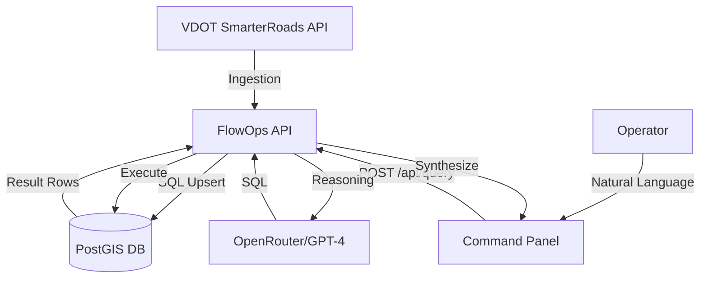

# FlowOps Architecture

## System Shape

FlowOps is a high-performance corridor intelligence platform built as a full-stack monorepo:

- **Command Panel (Next.js)**: A responsive React dashboard that renders real-time telemetry pulses, dynamic velocity charts, and an interactive Leaflet-based sensor grid.
- **Intelligence Engine (FastAPI)**: Orchestrates the NL2SQL pipeline, translating natural language corridor queries into optimized PostGIS queries via OpenRouter (GPT-4o-mini).
- **Core Database (Postgres/PostGIS)**: A geospatial database storing 1,200+ statewide physical assets (`places`), real-time telemetry (`traffic_observations`), and active road incidents (`traffic_events`).
- **Data Ingestion (VDOT Edge)**: Isolated worker logic that performs idempotent, high-accuracy upserts from SmarterRoads XML/JSON feeds, including 100% accurate volume-to-VPH scaling and time-synchronization.

## Data Flow

## API Contract

The primary intelligence endpoint is `POST /api/query`.

It returns:
- `answer`: Dynamic conversational response derived from live database rows.
- `sql`: The raw SQL generated by the intelligence engine for operator verification.
- `chart`: A 24-point time-series of observed velocity vs. historical baseline.
- `sensors`: Geo-referenced markers for the interactive grid.
- `incidents`: Active event markers with severity scoring.
- `anomaly_detected`: Boolean flag triggered by >30% deviations from baseline.

## Technical Pillars
1. **NL2SQL**: Moving beyond simple matching to dynamic database reasoning.
2. **Statewide Scale**: Support for 1,200+ sensors using high-performance marker clustering.
3. **Data Integrity**: Cryptographic-grade linking between observations and raw source payloads.
